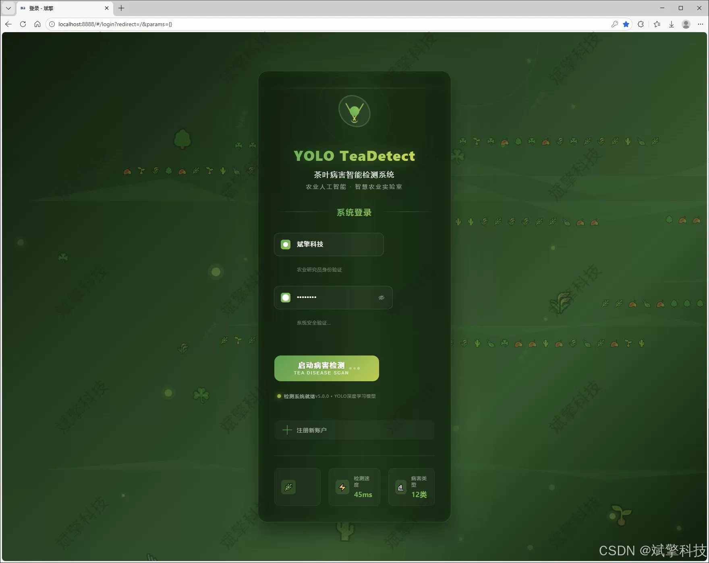
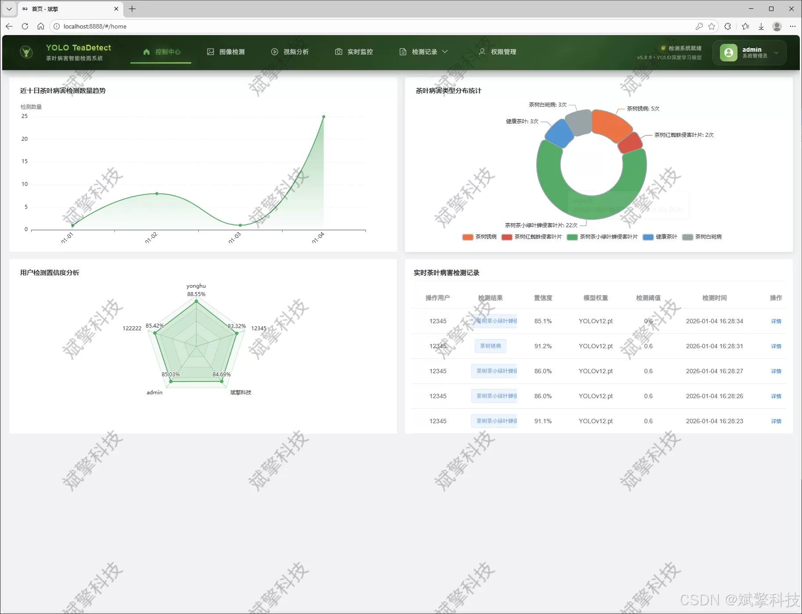
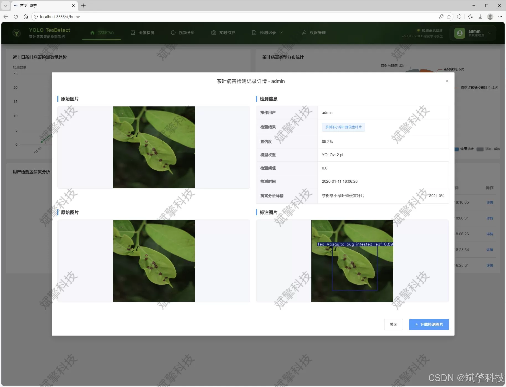
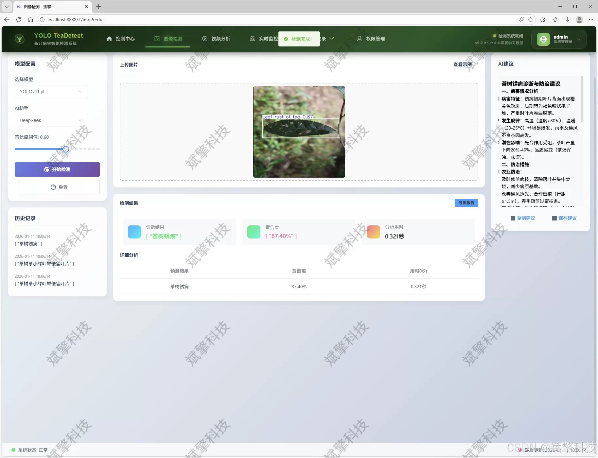
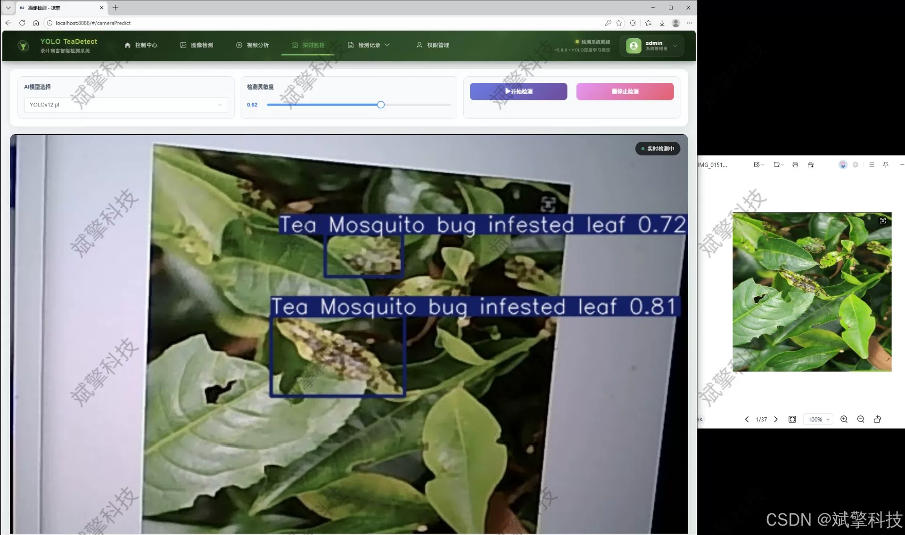
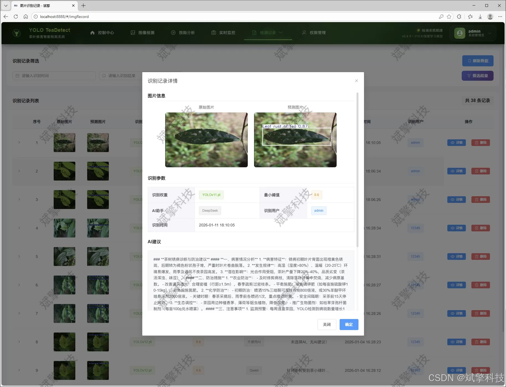
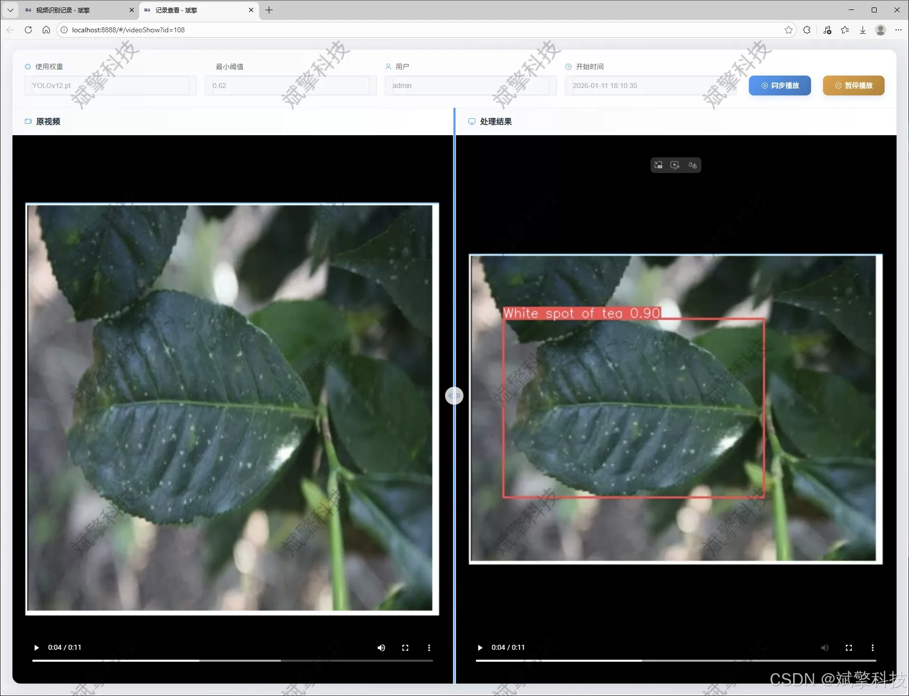
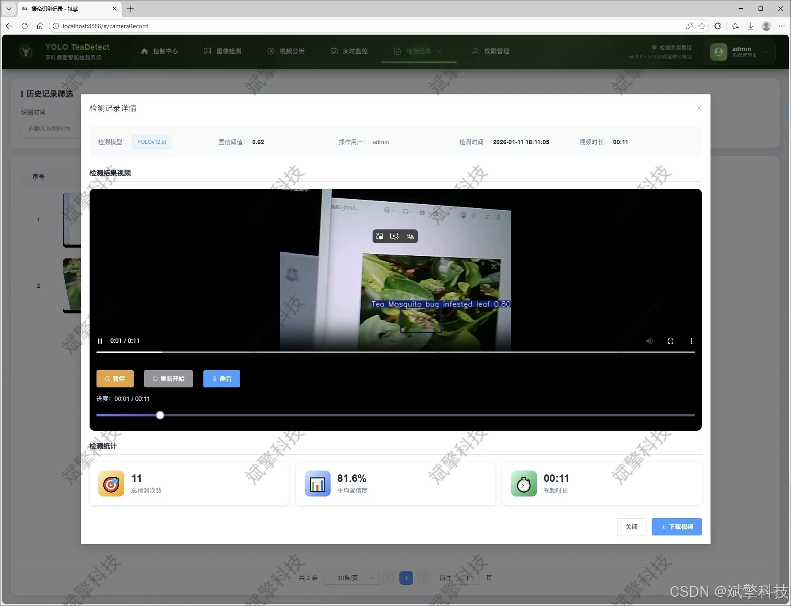
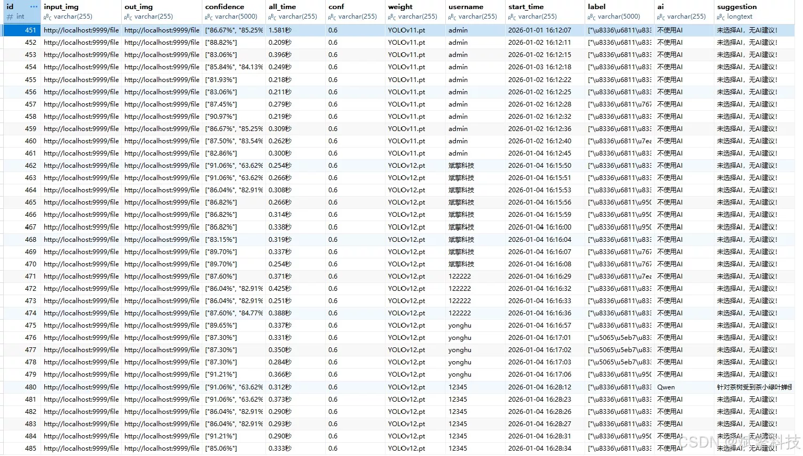

# YOLO+DeepSeek Tea Disease Detection System

## Body

The YOLO+DeepSeek tea disease detection system is based on the YOLO deep learning and the large models of Qianwen and DeepSeek. The system includes a web interface for intelligent analysis, a front-end separation, YOLO data, and YOLOv8/YOLOv10/YOLOv11/YOLOv12.

This paper addresses the issues of numerous diseases in tea plantation, difficulty in early identification, low efficiency and easy misjudgment of traditional manual inspection. A kind of intelligent tea disease detection system based on deep learning and Web technology is proposed and implemented. The system adopts a separation architecture mode of front-end and back-end, with SpringBoot framework as the core to build an efficient and stable server environment, and MySQL database to manage user information, detection records and model data. The front end provides a user-friendly web interaction interface.

The core detection model of the system integrates the latest advancements in YOLO series object detection algorithms, including YOLOv8, YOLOv10, YOLOv11, and YOLOv12. Users can flexibly switch between models based on their actual scene requirements for accuracy and speed. We have constructed a specialized image dataset containing eight categories of tea health and disease conditions, covering: black rot disease of tea leaves, brown and dry rot disease of tea leaves, rust disease of tea leaves, red spider mite damage to leaves, leaf miner damage to leaves, healthy tea leaves, white spot disease of tea leaves, and other diseases. The training set consists of 4736 images, the validation set includes 273 images, and the test set includes 406 images, providing a solid data foundation for model training.

The system is comprehensive in functionality, not only implementing user login and registration as well as personal center management but also providing multiple detection modes for images, videos, and real-time camera streams. All detection records are structuredly stored to facilitate traceability and analysis. Moreover, the system innovatively integrates the DeepSeek large language model, providing intelligent pathological analysis and prevention and treatment suggestions for detection results, greatly enhancing the practicality and depth of interaction of the system.

Functional module

✅ User Login and Registration: Supports password detection, saves to MySQL database.

✅ Supports four YOLO model switches, YOLOv8, YOLOv10, YOLOv11, YOLOv12.

✅ Information Visualization, Data Visualization.

✅ Image detection supports AI analysis functions, deepseek and Qianwen.

✅ Supports image detection, video detection, and real-time camera detection. The results are saved to a MySQL database.

✅ Picture recognition record management, video recognition record management and camera recognition record management.

✅ User Management Module, administrators can add, delete, modify, and query users.

✅ Personal center, can modify their own information, password name profile picture and so on.

There is no Lunwen writing service, nor any Lunwen.

## Images

## Payment

Here is a pay link on Stripe ( https://buy.stripe.com/3cs8yP7sY87d0vu9AB ). Please contact me lonlonago@foxmail.com after funding $89, and I will send you a complete data files , thank you!

